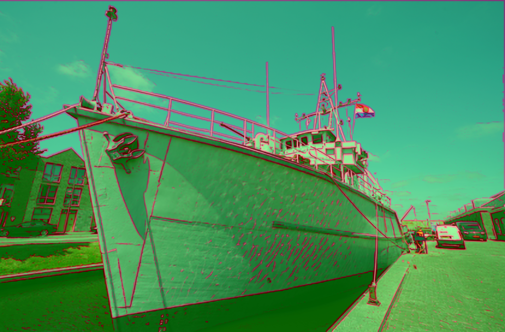
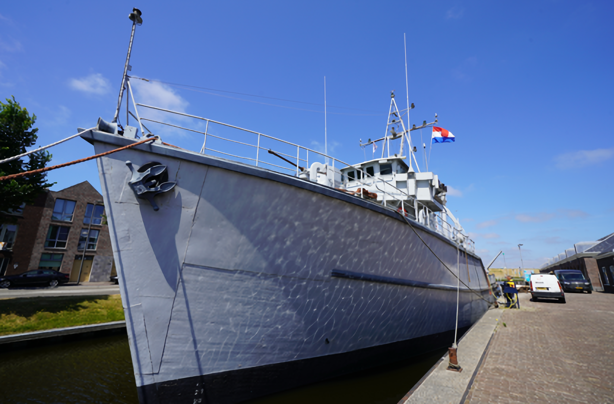

# Accelerating Image Super-Resolution Networks with Pixel-Level Classification
[](https://3587jjh.github.io/PCSR/)
[](https://arxiv.org/abs/2407.21448)

<div align="justify">
<b>Abstract</b>: In recent times, the need for effective super-resolution (SR) techniques has surged, especially for large-scale images ranging 2K to 8K resolutions. For DNN-based SISR, decomposing images into overlapping patches is typically necessary due to computational constraints. In such patch-decomposing scheme, one can allocate computational resources differently based on each patch's difficulty to further improve efficiency while maintaining SR performance. However, this approach has a limitation: computational resources is uniformly allocated within a patch, leading to lower efficiency when the patch contain pixels with varying levels of restoration difficulty. To address the issue, we propose the Pixel-level Classifier for Single Image Super-Resolution (PCSR), a novel method designed to distribute computational resources adaptively at the pixel level. A PCSR model comprises a backbone, a pixel-level classifier, and a set of pixel-level upsamplers with varying capacities. The pixel-level classifier assigns each pixel to an appropriate upsampler based on its restoration difficulty, thereby optimizing computational resource usage. Our method allows for performance and computational cost balance during inference without re-training. Our experiments demonstrate PCSR's advantage over existing patch-distributing methods in PSNR-FLOP trade-offs across different backbone models and benchmarks.
</div> 
<br>

## Dependencies
- Python 3.7<br>
- Pytorch 1.13<br>
- NVIDIA GPU + CUDA<br>
- Python packages: `pip install numpy opencv-python pandas tqdm fast_pytorch_kmeans`

## Demo
We provide a demo that performs 4x super-resolution using an original input image (supports only 4x scaling and .png format):
```
python demo.py --img_path <image path> --k <value> --out_dir <output path> [--adaptive] [--no_refinement]
```
For a detailed description of the arguments and outputs, please refer to `demo.py` and the `results` directory.
<div style="display: flex;">
    <figure style="margin: 0; text-align: center;">
        
        <figcaption>Classification</figcaption>
    </figure>
    <figure style="margin: 0; text-align: center;">
        
        <figcaption>SR Result (X4)</figcaption>
    </figure>
</div>

## Train
We offer a variety of pretrained models available in the `save` directory.<br>

### Data preprocessing
We use the DIV2K training set as our base.
```
cd datasets/scripts
python data_augmentation.py
python extract_subimages.py
python generate_mod_LR_bic.py
```
### Run training scripts (example usage)
(Please move the pretrained model to a different directory to train a new model!)
```
# original model
./dist.sh train.py --config configs/carn-x4.yaml --gpu 0

# PCSR model (2-stage)
./dist.sh train_pcsr.py --config configs/carn-pcsr-phase0.yaml --gpu 0,1
./dist.sh train_pcsr.py --config configs/carn-pcsr-phase1.yaml --gpu 0
```

## Test
Please refer to `test.py` and `test_pcsr.py` for a detailed description of the arguments.
```
# original model
python test.py --config <config path> --hr_data <hr foler> --lr_data <lr folder> --per_image --crop

# PCSR model (phase1)
python test_pcsr.py --config <config path> --hr_data <hr foler> --scale <integer scale> --per_image --crop --k 0 [--adaptive]
```

## Citation
```
@inproceedings{jeong2025accelerating,
  title={Accelerating Image Super-Resolution Networks with Pixel-Level Classification},
  author={Jeong, Jinho and Kim, Jinwoo and Jo, Younghyun and Kim, Seon Joo},
  booktitle={European Conference on Computer Vision},
  pages={236--251},
  year={2025},
  organization={Springer}
}
```

## Acknowledgement
This repo is based on [LIIF](https://github.com/yinboc/liif) and [KAIR](https://github.com/cszn/KAIR). 
